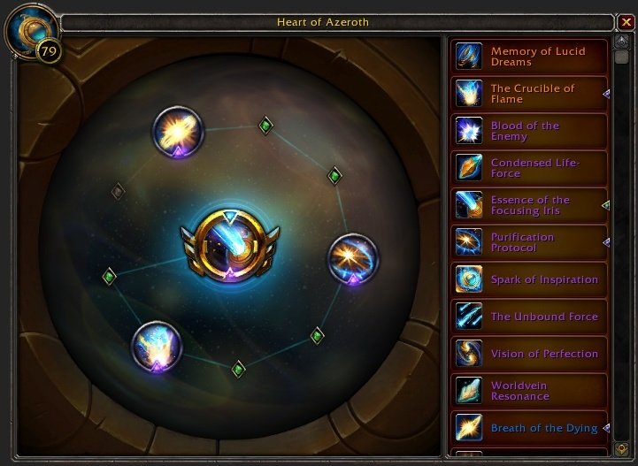
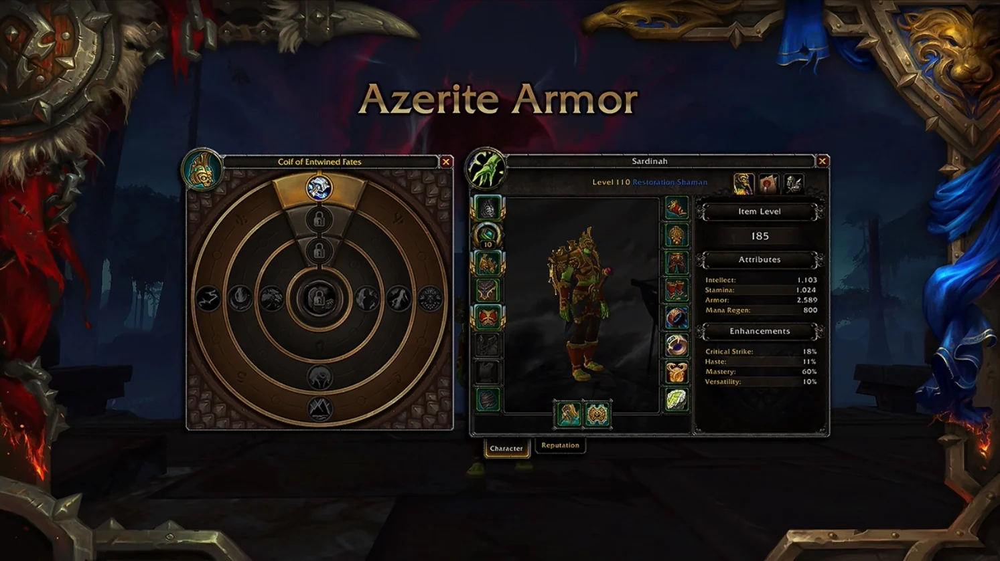
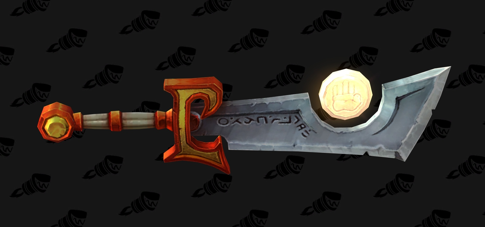
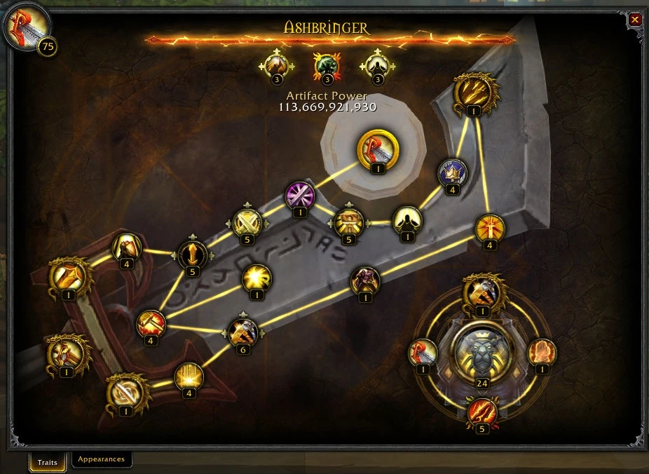

# WoW System Tier List

- My sole opinion about the systems implemented in World of Warcraft
- Each different system is assigned a category from S to D (S being the highest, D being the lowest)
- The higher the tier the system is, the more fun it was for **me** to play the game when it was in the game
- B being a tier where system didn't affect the fun I had (Meaning C and below having a negative impact on the fun and vice versa)
- Every system is gonna have a comment explaining my reasoning

## S

### Essence Power
The Essence power system locked your Neck gear slot during the Battle for Azeroth expansion by granting you the **Heart of Azeroth** that gave you the ability to collect and use 3 passive abilites and 1 activate ability gathered from the entire content of Battle for Azeroth.

The ablities were wonderful and really added an interesting bonus to your class depending on the build you went. Some of the abilities gave you just average damage boost by random procs, but you also could cooperate with your group and provide bonus to each other when cooperating and executing right.

## A

### Azerite Armor
A system that relied on the level of your **Heart of Azeroth**, same as the [Essence Power](#essence-power) system, which consumed your Helm, Shoulders and a Chest equipment slots.

Based on the level of your Heart Of Azeroth different level gear provided different passive abilites and stats that you get to choose from. You could farm a different piece for the specific bonus you wanted.

It was an interesting way how your could build your character. The Heart of Azeroth level requirement didn't really bother you at all and the abilities were good. You could buy a specific Azerite piece later in the expansion which didn't really affect my gameplay.

## B

### Artifact Weapons
**An Amazing concept I would have loved to see implemented in a different way**

A very cool system where each spec and class got to use a legendary weapon that had a story and an incredible power during the Legion expansion. 

*For example this legendary Paladin weapon called Ashbringer*

I am putting it in C beacuse it made the weapon slot completely useless during the expansion. There were no alternatives for the most meaningful gear slot in the game. And beacuse of a system that the Artifact Weapons brought called the **[Artifact Power](#artifact-power)**.

I would have much more liked to see it being a temporary item during for example a raid run given at the start and used only for that run so the weapon slot is used for example in dungeons or any other content. Not for the whole expansion. The Artifact Power system could have been simplified for the run so it gives a bonus after each boss for example.

## C

## D

### Artifact Power

Artifact Weapons introduced the mechanic of an Artifact Power that could have been infinitely grinded during the expansion making the Weapon stronger. Which was not a very bad conpect given that almost every weapon being in the lore was an amazing artifact. For some time this Artifact Power unlocked a new perks some being a passive increases or abilities, some even being a fantastic active abilities we can see used even today.

After unlocking all of these abilities we were unfortunately greeted by an infinite Artifact Power spender passive ability that didn't really make a sense for me and made the whole number grinding system unfun. There was also a very nicely implemented catchup mechanic for gaining the Artifact Power which made people gain the Artifact Power faster based on for how long has the system went on.

## Haven't done

### Ashran

I haven't done this as I haven't played actively during the WoD expansion